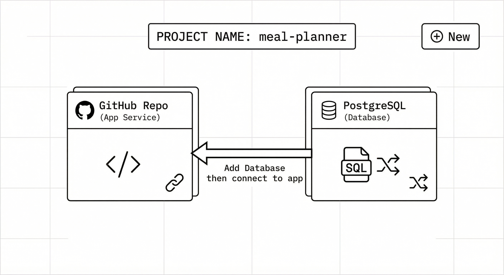
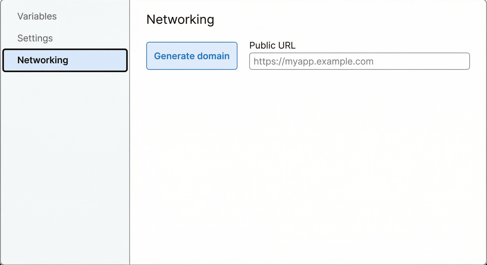

# Railway deployment: step-by-step guide

Deploy the Meal Planner app to [Railway](https://railway.app) using this guide. Do the steps in order.

**Images:** Reference diagrams for key steps are included below. If you don’t see them, the text is enough to follow. Images live in the `docs/` folder (e.g. `railway-step1-new-project.png`).

---

## Before you start

- [ ] Code is in a **GitHub** repo (Railway deploys from GitHub).
- [ ] You have a **Railway** account. Sign up at [railway.app](https://railway.app).
- [ ] You have your **Anthropic (Claude) API key** for recipe generation.

**Postgres only:** The app uses PostgreSQL. The build copies `prisma/schema.postgres.prisma` over `schema.prisma` before `prisma generate`, so the deployed app always uses the Postgres client regardless of repo or cache.

---

## Step 1: Create a project and connect GitHub


1. Open [railway.app](https://railway.app) and log in.
2. On the dashboard, click **"New Project"**.
3. Choose **"Deploy from GitHub repo"** (not "Empty project" or "Template").
4. If asked, **authorize Railway** to access your GitHub account.
5. Select the **meal-planner** repository (or the repo where this code lives).
6. Railway will add a **service** and may start a build. You can let it build; we’ll add the database and variables next.

**What you’ll see:** A project with one service (your app). The service might show "Building" or "Deployed". You may see a default generated domain later.

---

## Step 2: Add a PostgreSQL database



Your app needs a database. On Railway, we use **PostgreSQL** (SQLite doesn’t persist on their servers).

1. Inside your **project** (not the service), click **"+ New"** (or **"Add service"**).
2. Choose **"Database"** → **"PostgreSQL"**.
3. Wait until the Postgres service shows as **Ready** or **Active**.
4. **Connect it to your app** so the app gets `DATABASE_URL`:
   - Click the **PostgreSQL** service.
   - Open the **"Variables"** or **"Connect"** tab.
   - You should see `DATABASE_URL`. Either:
     - Use **"Connect"** / **"Add to project"** and select your **app service**, so Railway injects `DATABASE_URL` into the app, or  
     - Copy the `DATABASE_URL` value; we’ll paste it into the app’s variables in Step 4.

**What you’ll see:** Two (or more) services in the project: one from GitHub (your app) and one PostgreSQL database.

---

## Step 3: Use PostgreSQL in your app (one-time code change)

Your app’s Prisma config must use PostgreSQL when running on Railway.

1. On your computer, open **`prisma/schema.prisma`** in this repo.
2. Find the **`datasource db`** block (near the top).
3. Change **`provider = "sqlite"`** to **`provider = "postgresql"`** so it looks like this:

   ```prisma
   datasource db {
     provider = "postgresql"
     url      = env("DATABASE_URL")
   }
   ```

4. **Save the file**, then **commit and push** to GitHub (e.g. `main`).

**Note:** For local development you’ll need a Postgres `DATABASE_URL` too (e.g. the same Railway URL, or a local Postgres / [Neon](https://neon.tech) free tier). Keep using that in your local `.env`.

---

## Step 4: Set environment variables on the app


1. In Railway, click your **app service** (the one from GitHub, not Postgres).
2. Open the **"Variables"** tab (or **"Settings"** → **Variables**).
3. Add or confirm these variables:

   | Name                 | Value                                      | Required |
   |----------------------|--------------------------------------------|----------|
   | `DATABASE_URL`       | Postgres URL from Step 2 (or auto if linked)| Yes      |
   | `ANTHROPIC_API_KEY`  | Your Claude API key                        | Yes      |
   | `UNSPLASH_ACCESS_KEY`| Unsplash API key ([unsplash.com/developers](https://unsplash.com/developers)) | No (optional) |

4. If you had to copy `DATABASE_URL` from Postgres, paste it as a **new variable** here. Don’t remove Railway’s `PORT` if it’s already set.

**What you’ll see:** A list of variables; `DATABASE_URL` and `ANTHROPIC_API_KEY` must be present for the app to run and generate recipes.

---

## Step 5: Migrations (already configured)

This repo’s **`railway.toml`** is set up so Railway runs **`npx prisma migrate deploy`** before each deploy. You don’t need to set a “Release command” in the UI unless you want to override it.

- If you ever need to run migrations by hand (e.g. first time), use:  
  `DATABASE_URL="your-postgres-url" npx prisma migrate deploy`  
  with the same URL your app uses on Railway.

---

## Step 6: Deploy and open the app



1. Trigger a deploy:
   - **Option A:** Push a new commit to the branch Railway is watching (e.g. `main`).  
   - **Option B:** In the Railway dashboard, open your app service and click **"Deploy"** or **"Redeploy"**.
2. Wait until the **build** and **pre-deploy** (migrations) finish. Check the **"Deployments"** or **"Logs"** tab if something fails.
3. Generate a public URL:
   - Open your **app service** → **"Settings"** (or **"Variables"** area).
   - Find **"Networking"** or **"Public networking"**.
   - Click **"Generate domain"** (or **"Add domain"**). Railway will assign a URL like `your-app.up.railway.app`.
4. Open that URL in your browser. You should see the Meal Planner app.

**What you’ll see:** A successful deployment and a clickable link to your live app.

---

## Checklist

- [ ] **Step 1:** New project created; repo connected; app service exists.
- [ ] **Step 2:** PostgreSQL service added and (if needed) `DATABASE_URL` copied or linked to app.
- [ ] **Step 3:** `prisma/schema.prisma` uses `provider = "postgresql"` and changes are pushed to GitHub.
- [ ] **Step 4:** App service has `DATABASE_URL` and `ANTHROPIC_API_KEY` (and optionally `UNSPLASH_ACCESS_KEY`) in Variables.
- [ ] **Step 5:** No extra action if `railway.toml` is in the repo (migrations run automatically).
- [ ] **Step 6:** Deploy succeeded and you opened the app via the generated domain.

---

## If something goes wrong

- **Build fails:** Check **Deployments** → select the failed deploy → **View logs**. Often it’s a missing env var or Prisma error (e.g. wrong `DATABASE_URL`).
- **App crashes or “Database” errors:** Ensure `DATABASE_URL` is set on the **app** service and matches the Postgres service. Run migrations once manually if needed (Step 5).
- **Recipe generation doesn’t work:** Confirm `ANTHROPIC_API_KEY` is set and valid in the app’s Variables.

### “The URL must start with the protocol 'file:'” (SQLite vs Postgres)

This means Railway is building with **SQLite** in `prisma/schema.prisma` while `DATABASE_URL` is a **Postgres** URL. Fix it by making sure the code Railway builds from uses Postgres and by clearing cache:

1. **Confirm on GitHub**  
   Open your repo on GitHub → **prisma/schema.prisma** (on the branch Railway deploys from, usually `main`). The file must contain:
   ```prisma
   datasource db {
     provider = "postgresql"
     url      = env("DATABASE_URL")
   }
   ```
   If it still says `provider = "sqlite"`, update it locally, then push:
   ```bash
   git add prisma/schema.prisma
   git commit -m "Use postgresql in schema for Railway"
   git push origin main
   ```

2. **Clear Railway’s build cache**  
   In Railway: open your **app service** → **Settings** → find **“Build”** or **“Clear build cache”** (or **“Redeploy”** with **“Clear cache”** if offered). Trigger a new deploy so the build doesn’t reuse an old copy of the repo.

3. **Check the branch Railway uses**  
   In your app service **Settings**, confirm the **branch** (e.g. `main`) is the same one where you pushed the `postgresql` change.

4. **Redeploy**  
   Click **Deploy** / **Redeploy** and watch the build logs. The build should run `prisma generate` with `provider = "postgresql"` and the error should go away.

**Automatic fix in this repo:** The build runs `scripts/ensure-postgres-schema.js` before `prisma generate`. When `DATABASE_URL` is a Postgres URL (as on Railway), that script rewrites `schema.prisma` to use `provider = "postgresql"` if it still says `sqlite`, so the correct client is generated even when the repo or cache has the old schema.

For more detail, see the main **[DEPLOY.md](../DEPLOY.md)** in the repo root.
